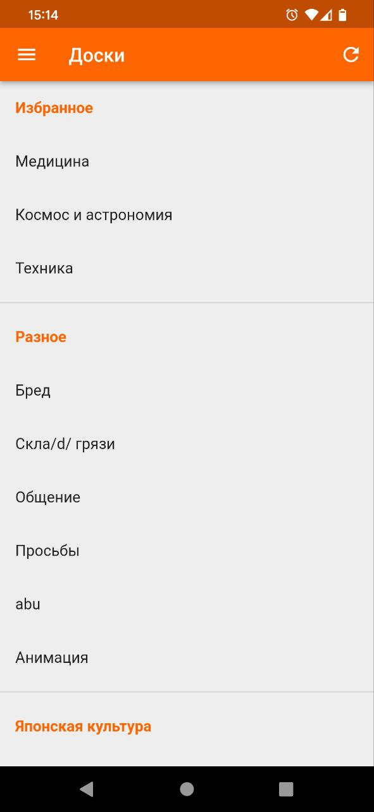

# Treechan

2ch клиент с древовидной системой постов. 
Еще в разработке, но уже можно пользоваться ридонли.

Возможности:
 - Сворачивание веток постов, возможность отображать все ветки свернутыми или развернутыми изначально
 - Добавление досок в избранное, изменение их порядка в избранном
 - Поисковская строка в боковой панели: можно вставить ссылку или тег доски и перейти туда
 - Настройка темы приложения
 - Альтернативный вид отображения треда: включение горизонтальной прокрутки для удобства чтения длинных веток

TODO: [Trello](https://trello.com/b/JxlUBxC0/todo "Trello")

  
   
   

  
  
   

